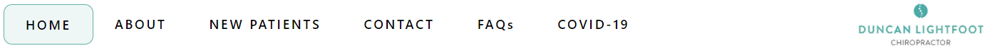
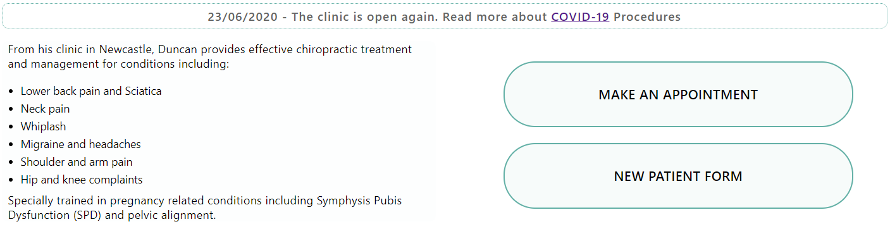
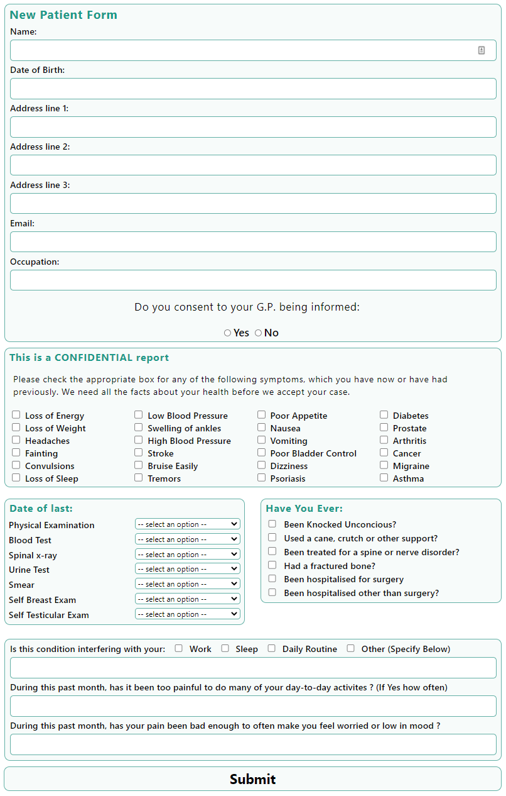
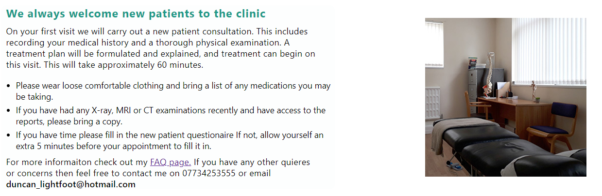

# Duncan Lightfoot | Chiropractor

## Breif

The client requested a new website for his Chiropractic Clinic. The main objective for the website is to easily display relivent information across multiple platforms.

The brief requires 6 pages and a form
* Home
* About
* New Patients
* Contact
* FAQ
* COVID-19
* New Patient Form

## Features

### Existing Features

* Navigation Bar
    * Featured on all pages the navigation bar provides easy access to each of the 6 main pages. Accented with a ring to display which page the user is on.
    * This allows for easy navigation without relying on the use of the browsers back button.
    * The navigation bar will change to a hamburger menu once the device screen become too small.
    * The new design features a centralised logo and a home button for easy navigation to the home page.

* Landing Page Images
    * The landing page contains 3 images, the number of images changed based on what device the user is on. For small screens there is only 1 image and for medium size screens there are 2.

* Home Page main
    * The main page consists of two sections, one of which gives a brief overview of Duncan and what treatments he has available.
    * The other section contains two buttons, one opens a pop up in the middle of the page, this is so the user can book an appointment easily without having to contact Duncan directly. The second button opens up the new patient form in a new tab. 

* New Patient Form

* About
    * The about page contains a brief description of Duncans education, speciallity and registration credentials.
    * In future this is a section that Duncan would like to impove with some more personal information to make the website appear more friendly.

* New Patients

* Footer

## Testing

### Validation Testing
The Wave chrome extension was used to highlight errors and accesability issues.
Validation testing was run through three validation websites.
* https://web.dev/ 
* https://jigsaw.w3.org/css-validator/ 
* https://validator.w3.org/nu/

During web.dev testing accessabity recieved a score of 79, which was below the average for the website. To help coroberate this low score the "Wave" chrome extension was used to identify the issue.
The Wave extension highlighted an error with labels around the "Have you ever section", specifically the spinal question. There appeared to be an extra underscore at the end of the ID.
Once that typo was fixed the score imporved to 95 which is more in line with the other pages.
Following this error the 'Wave' pluging was used accross all pages and returned no errors.

The jigsaw validator returns no errors, however there are some warnings regarding text styling which could be addressed in further revisions.

The html validator returned warnings on all pages for "role=navigation" this was required early on in the hamburger menu creation, it is no longer required so it was removed. 
It returned some errors reguarding legend position within the fieldset, in all cases the legend was moved directly under the fieldset.
Finally there were some erros regarding option elements consisting purely of spaces. Instead "select an option" text was added as an option and that box was hidden, disabled and selected by deafult.

### User Testing
* Initial Testing
    * Inital testing was mainly completed in a test enviroment with occasional relase to 2 test participants to pull up real world errors on diffent devices.
* Midway Testing
    * Sent out to 4 test participants, of which one suggested addition of home button to improve navigation on smaller screens.
* Final Testing
    * Sent out the final website to a batch of 10 participants.
    * The hero immage did not correctly size on a small screen, this was because it was a wide image. As a result it was changed to 3 images which reduced to 2 then 1 as the screen size changed
    * It was pointed out that one of the links on the page was not quite clear, that was also ammended.

## Bugs
* The footer does not compress as desired by the client when the device size is changed. The client has requested that some information be extracted/changed from the footer and placed elseware on the website. Once the customer has finalised his requests the bug will then be fixed.
* On the form there are a couple of minor issues around scaling between boxes, the client has mentioned he would like the page reconfigured therefore it is not a priority to fix the bug when the feature will be changed before launch.

## Future Updates
* Feedback from the final testing suggested that clickable links be attached to the logo, bca and gcc.
* Create an online oppointment calendar and be able to select appointment times.

## Deployment
The website was deployed through the GitHub 'pages' feature. It can be acessed through the link below.
https://davidhearl.github.io/chiropractic-website/

## Credits
* 'Hamburger menu based off code by Erik Terwan'