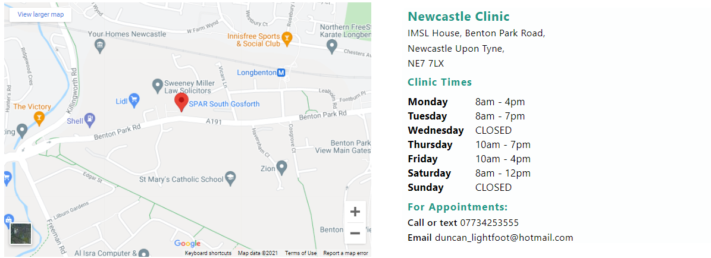
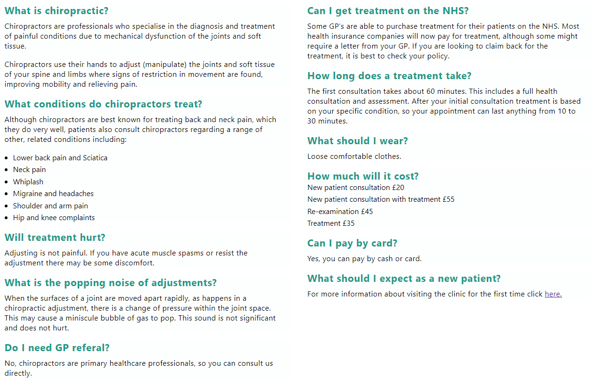
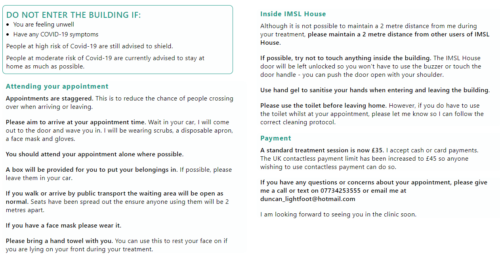
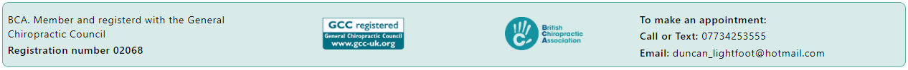

# Duncan Lightfoot | Chiropractor

## Brief

The client requested a new website for his Chiropractic Clinic. The main objective for the website is to easily display relevant information across multiple platforms.

The brief requires 6 pages and a form;
* Home
* About
* New Patients
* Contact
* FAQ
* COVID-19
* New Patient Form

## Features

### Existing Features

* Navigation Bar
    * Featured on all pages the navigation bar provides easy access to each of the 6 main pages. Accented with a ring to display which page the user is on.
    * This allows for easy navigation without relying on the use of the browsers back button.
    * The navigation bar changes to a hamburger menu once the device screen becomes too small.
    * The new design features a centralised logo and a home icon for easy navigation to the home page.

* Landing Page Images
    * The landing page contains three images, the number of images changes based on what device the user is on. For small screens there is only one image and for medium size screens there are two.

* Home Page main
    * The main page consists of two sections, one of which gives a brief overview of Duncan and what treatments he has available.
    * The other section contains two buttons, one opens a pop up in the middle of the page, this is so the user can book an appointment easily without having to contact Duncan directly. The second button opens up the new patient form in a new tab. 

* New Patient Form
    * The New Patient form will replace the current system. The current system uses a PDF that gets printed out and filled in manually.
    * One of the requirements of the form is that it is able to be printed out into an A4 sheet, as the current filing system is still paper based.
    * Checkboxes and drop down menus have been used where possible to standardise the inputs from the client, further information is then obtained in person.

* About
    * The about page contains a brief description of Duncan's education, specialty and registration credentials.
    * In future this is a section that Duncan would like to impove with some more personal information to make the website appear more friendly.

* New Patients
    * The new patient section contains specific information that would be useful to a new patient.
    * One section outlines what the patient will need to bring with them, so Duncan can provide the correct treatment for their condition.
    * The new patient page also includes a picture of his practice to help the patient familiarise with the environment to ease nerves.

* Contact
    * The contact page displays a map and the address of the practice.
    * It also contains a timetable of when the practice is open.
    * Duncan's contact details are also present if needed.

* FAQ
    * The FAQ section contains all the frequently asked question Duncan receives.
    * For easy reading on a mobile device the text compresses into one column to improve flow.

* COVID-19
    * The COVID-19 page displays all of the current COVID-19 measures for Duncan's practice.
    * This page is vital as it keeps everyone up to date with the current measures in place to keep everyone safe.
    * The client has mentioned that as restrictions are relaxing the page can either be removed or relocated as the informaiton becomes outdated.

* Footer
    * The footer includes important information such as Duncan's BCA membership details, which show he is a licenced medical professional.
    * It also displays the organisations he is affiliated with to show his treatments align with the appropriate medical conventions.
    * The footer also contains Duncan's contact details, as they are contained in the footer they are easily accessible no matter what page the user is on.

## Testing

### Validation Testing
The Wave chrome extension was used to highlight errors and accesability issues.
Validation testing was run through three validation websites.
* https://web.dev/ 
* https://jigsaw.w3.org/css-validator/ 
* https://validator.w3.org/nu/

Web.dev testing accessibity received a score of 79, which was below the average for the website. To help corroberate this low score the "Wave" chrome extension was used to identify the issue.
The Wave extension highlighted an error with labels around the "Have you ever section", specifically the spinal question. There appeared to be an extra underscore at the end of the ID.
Once the typo was fixed the score improved to 95 which is more in line with the other pages.
Following this error the 'Wave' plug-in was used accross all pages and returned no errors.

The jigsaw validator returned no errors, however, there are some warnings regarding text styling which could be addressed in future revisions.

The html validator returned warnings on all pages for "role=navigation". This was required early in the hamburger menu creation, and was no longer required so it was removed. 
It returned some errors reguarding the legend position within the fieldset, in all cases the legend was moved directly under the fieldset.
Finally, there were some errors regarding option elements consisting purely of spaces. Instead "select an option" text was added as an option and that box was hidden, disabled and selected by deafult.

### User Testing
* Initial Testing
    * Initial testing was mainly completed in a test enviroment with occasional release to two test participants to pull up real world errors on different devices.
* Midway Testing
    * Sent out to four test participants, of which one suggested the addition of home button to improve navigation on smaller screens.
* Final Testing
    * Sent out the final website to a batch of ten participants.
    * The hero image did not correctly size on a small screen, this was due to its wide aspect ratio. As a result it was changed to 3 images which reduced to 2 then 1 as the screen size changed.
    * It was pointed out that one of the links on the page was not quite clear, that was also ammended.

## Bugs
* The footer does not compress as desired by the client when the device size is changed. The client has requested that some information be extracted/changed from the footer and placed elsewhere on the website. Once the customer has finalised his requests the bug will then be fixed.
* On the form, there are a couple of minor scaling issues between boxes. The client has mentioned he would like the page reconfigured, therefore it is not a priority to fix the bug as the feature will be changed before launch.

## Future Updates
* Feedback from final testing suggested that clickable links be attached to the logo, bca and gcc.
* Create an online appointment calendar and be able to select appointment times.
* In future, the client plans to set up some social media pages. Once this is done icons to the relevant sites could be included.

## Deployment
The website was deployed through the GitHub 'pages' feature. It can be acessed through the link below.
https://davidhearl.github.io/chiropractic-website/

## Credits
* Hamburger menu based off code by, Erik Terwan.